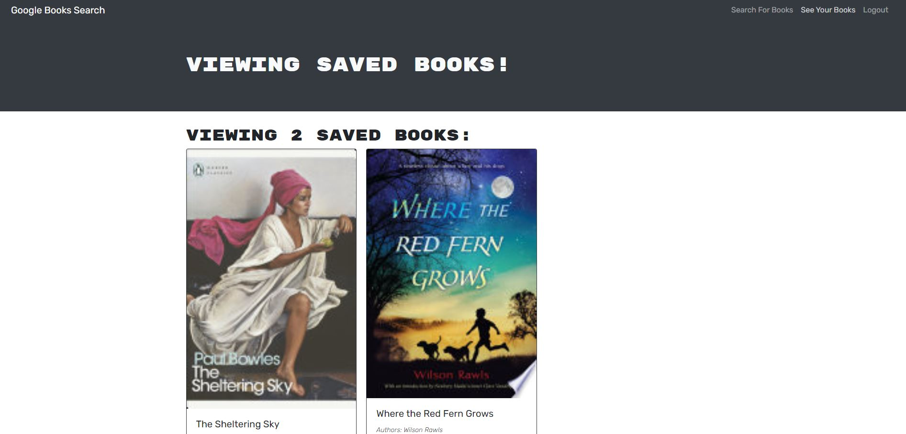

# Book Search Engine
Module 21 Challenge: MERN

## Live Link
https://bburns-book-search-engine.herokuapp.com/

## Repository Link
https://github.com/blakerichardburns/book-search-engine

## Description
Code refactor for an application that pulls book information searches from Google's API, and save them to a user's profile. Intended the test the developer's abilities to coordinate a full MERN stack application.

  ## Table of Contents
  * [Installation Instructions](#installation-instructions)
  * [Usage Information](#usage-information)
  * [Questions](#questions)

  ## Installation Instructions
  Dependencies: apollo-server-express, bcrypt, express, jsonwebtoken, mongoose

  ## Usage Information
  N/A

  ## Questions
  For any inquiries, spam by inbox here: blakerichardburns@gmail.com
  To peruse more of my portfolio, check this out: [blakerichardburns](https://github.com/blakerichardburns)